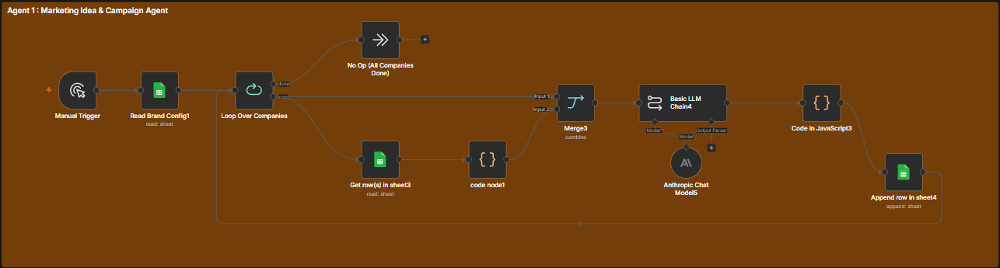
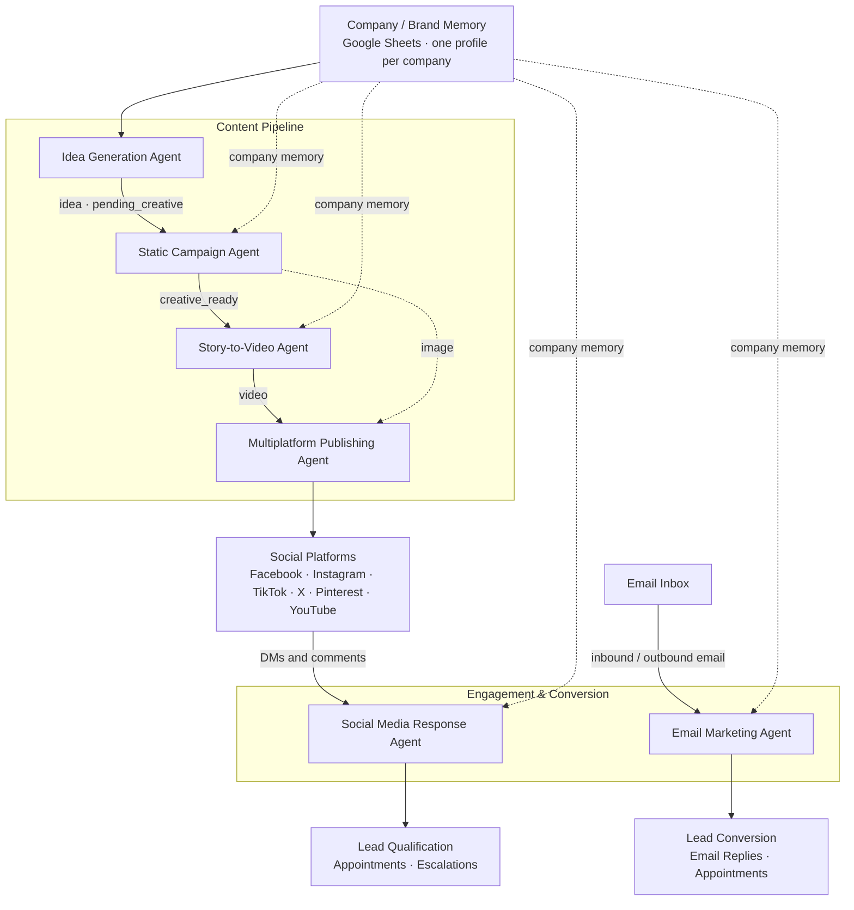

<div align="center">

# BrandFlow AI

### Autonomous Multi-Agent Marketing System

A brand-aware AI pipeline that turns a company's stored brand memory into finished, published marketing campaigns — generating the idea, the image, and the video, publishing across six platforms, and then handling the inbound social and email conversations automatically.

</div>

<div align="center">


</div>

---

## Project Overview

BrandFlow AI is a multi-agent marketing automation system built as a single n8n workflow. For every company it manages, the system reads that company's stored brand memory, generates a unique marketing idea, turns the idea into a captioned social image and a short AI-generated video, and publishes the finished creative to Facebook, Instagram, TikTok, X, Pinterest, and YouTube — automatically.

Beyond content production, the system operates the demand it creates. It responds to social media DMs and comments in the brand's voice, captures and qualifies leads, books appointments into company calendars, sends outbound email campaigns, and replies to inbound email — all while keeping every interaction grounded in the correct company's approved messaging, language, and rules.

## Problem Statement

Running marketing for multiple companies is dominated by repetitive, disconnected manual work:

- **Slow, repetitive content production.** Every post requires a new idea, a caption, an image, a video, and hashtags — usually drafted by hand, one piece at a time, per platform.
- **Fragmented tooling.** Copywriting, image generation, video generation, and scheduling live in separate tools, forcing constant copy-paste and manual hand-offs between them.
- **Publishing complexity.** The same campaign must reach several platforms, each with its own accounts, formats, and posting requirements.
- **Fragile brand consistency.** When copy, offers, and claims are composed ad-hoc, off-brand messaging and invented promises slip through — especially at scale.
- **Multi-company chaos.** Teams serving many brands repeat the same process for every client and risk cross-company mixing of ideas, assets, and brand voice.

## Solution

BrandFlow AI replaces this fragmented workflow with one orchestrated pipeline of specialized agents, each owning a single stage of the marketing lifecycle:

- **A shared company/brand memory layer** (Google Sheets) acts as the single source of truth for each company — its identity, services, offers, voice, language, rules, logos, and approved links. Every agent reads from the same verified context.
- **Specialized agents** handle campaign ideation, image generation, video production, multiplatform publishing, social response, and email marketing, so no single prompt has to do everything.
- **Status-based queues** (`pending_creative` → `creative_ready` → `video_ready`) hand campaigns between agents automatically, so work flows downstream with no manual triggers.
- **Built-in guardrails** keep output brand-faithful: agents are instructed never to invent offers, claims, or links; logos and URLs are resolved from company memory only; and missing assets are flagged rather than guessed.
- **Downstream execution is automated end-to-end** — Gmail sends campaign emails and replies, Google Calendar books appointments, UploadPost publishes to six platforms, and the Meta Graph API answers DMs and comments.

## ✨ Key Features

- **Multi-agent marketing automation** — six specialized agents collaborate as a single pipeline, from idea to published content and lead follow-up.
- **Company-specific memory** — every agent works from the selected company's brand identity, voice, offers, and approved messaging.
- **Multi-company support** — one system runs the same pipeline for many companies, each fully isolated by company ID.
- **Automated content & creative generation** — AI writes the copy and generates the image and video from a single campaign idea.
- **Multi-platform publishing** — finished creative is posted to Facebook, Instagram, TikTok, X, Pinterest, and YouTube automatically.
- **Social media response & lead handling** — DMs and comments are answered in-brand, with lead capture, appointment booking, and human escalation.
- **Email marketing & lead conversion** — outbound campaigns and AI email replies turn interest into meetings and bookings.
- **Scalable agent architecture** — agents plug into shared status-based queues, so adding companies or channels extends the pipeline without rework.

## Multi-Agent Ecosystem

Six specialized agents run the system. Each owns one stage of the lifecycle — ideation, static creative, video, publishing, email, and social response — and hands its output to the next one through shared Google Sheets queues.

> **Company context in every agent.** Every agent is bound to a single company at a time:
>
> `Agent Role + Company ID + Company Memory = Correct Output`
>
> Each agent pulls the specific company's brand memory — brand identity, services, products, target audience, offers, brand voice, approved messaging, CTAs, approved links, language, and company-specific rules — and is explicitly instructed never to reference or blend in another company's information. Company IDs travel with every campaign from idea to publishing, and memory (past ideas, conversation history) is scoped per company. Content is generated one company at a time so brand context is never mixed.

---

## Agent 1 — Idea Generation Agent

<!-- AGENT 1 SCREENSHOT: idea-generation-agent.png
Capture the n8n workflow section containing the Idea Generation Agent.
The screenshot should clearly show the manual trigger, the per-company loop, the LLM chain, and the campaign row write-back.
-->


> Generates campaign, content, video and marketing ideas based on the selected company's brand memory.

**Key responsibilities**
- Generates unique marketing ideas
- Uses company-specific brand context
- Passes structured campaign requirements to the next agent

---

## Agent 2 — Static Campaign Agent

<!-- AGENT 2 SCREENSHOT: static-campaign-agent.png
Capture the n8n workflow section containing the Static Campaign Agent.
The screenshot should clearly show the sheets trigger, the caption/image-prompt LLM chain, the Gemini image node, and the logo compositing steps.
-->


> Turns a campaign idea into publish-ready static creative — captions, hashtags, and a generated image with the company logo overlaid.

**Key responsibilities**
- Creates captions, hashtags, and image prompts from brand memory
- Generates the image with Gemini and composites the company logo when available
- Hands the finished creative to the next agent as `creative_ready`

---

## Agent 3 — Story-to-Video Agent

<!-- AGENT 3 SCREENSHOT: story-to-video-agent.png
Capture the n8n workflow section containing the Story-to-Video Agent.
The screenshot should clearly show the creative_ready trigger, the video-script LLM chain, the Kling generation call, and the status polling loop.
-->


> Turns static creative into a short AI-generated marketing video with a written, timed story.

**Key responsibilities**
- Writes a 10-second scene-by-scene script and a cinematic generation prompt
- Renders the video with Kling AI and polls the job until it completes
- Stores the MP4 and writes the video URL back to the campaign row

---

## Agent 4 — Multiplatform Publishing Agent

<!-- AGENT 4 SCREENSHOT: multiplatform-publishing-agent.png
Capture the n8n workflow section containing the Multiplatform Publishing Agent.
The screenshot should clearly show the image and video UploadPost nodes for all six platforms.
-->


> Publishes every finished image and video to all connected social platforms in one step.

**Key responsibilities**
- Posts generated images to Facebook, Instagram, TikTok, X, Pinterest, and YouTube
- Posts generated videos to the same six platforms
- Routes posts across the connected publishing accounts

---

## Agent 5 — Email Marketing Agent

<!-- AGENT 5 SCREENSHOT: email-marketing-agent.png
Capture the n8n workflow section containing the Email Marketing Agent.
The screenshot should clearly show the campaign generator, the Gmail send and reply steps, and the calendar booking branch.
-->


> Runs outbound email campaigns and answers inbound email, including booking appointments.

**Key responsibilities**
- Generates and sends campaign emails in the brand's tone
- Detects the company behind each reply and answers in its approved voice
- Books meetings on the company calendar and confirms them

---

## Agent 6 — Social Media Response Agent

<!-- AGENT 6 SCREENSHOT: social-media-response-agent.png
Capture the n8n workflow section containing the Social Media Response Agent.
The screenshot should clearly show the webhooks, the AI Agent with its tools, and the channel router with the reply senders.
-->


> Answers DMs and comments on Facebook and Instagram in the company's voice and turns interest into leads, bookings, and escalations.

**Key responsibilities**
- Routes each interaction to the correct company profile
- Responds in-brand and qualifies leads into the leads sheet
- Books consultations, fetches website info, and escalates to humans when needed

---

## 🏗️ System Architecture



All six agents run as a single orchestrated n8n workflow. Company and campaign data lives in Google Sheets keyed by `company_id`, so every agent works from the correct brand memory and passes work downstream through status-based queues (`pending_creative` → `creative_ready`). The same pipeline is reused for every company — isolation comes from the shared memory layer, not from separate workflows.

---

## 🛠️ Tech Stack

| Technology | Purpose |
|---|---|
| **n8n** | Orchestration platform running the full multi-agent workflow |
| **Anthropic Claude** | LLM for ideas, copy, scripts, email, and social replies |
| **Google Gemini** | AI image generation |
| **Kling AI** | AI video generation (text-to-video) |
| **Google Sheets** | Company memory, campaign queues, and logging |
| **Google Drive** | Storage for generated images and videos |
| **Gmail** | Sending and replying to email |
| **Google Calendar** | Appointment scheduling |
| **Meta Graph API** | DM and comment replies on Facebook and Instagram |
| **UploadPost** | Publishing to six social platforms |

## 🔄 End-to-End Workflow

```
Company Memory → Marketing Idea → Campaign → Static Creative → Video
      → Multiplatform Publishing → Engagement (Social + Email) → Leads & Appointments
```

Each step is handed to the next agent through a status-based Google Sheets queue, keyed by company and campaign ID.

## 📁 Project Structure

```
BrandFlow-AI---Autonomous-Multi-Agent-Marketing-System/
├── README.md                                   # Project documentation
├── BrandFlow-AI-..._No_cred.json               # n8n workflow export (credentials stripped)
└── images/
    └── agents/                                 # Per-agent workflow screenshots
```

## 🚀 Setup

- **Import** the workflow JSON into n8n (cloud or self-hosted). The LangChain nodes and the UploadPost community node must be installed.
- **Credentials** — connect the integrations used by the workflow: Anthropic, Google (Sheets, Drive, Calendar, Gmail), Meta Graph API, UploadPost, and Kling AI.
- **Data layer** — create the Google Sheets used for company memory, campaign queues, leads, and logs, then point the sheet nodes at them.
- **Filters** — where the node notes indicate, configure the row filters (e.g. active companies, company-scoped reads) in the n8n editor.
- **Placeholders** — replace the remaining placeholder values in the workflow (e.g. the Kling API key) with your own.
- **Activate** — enable the workflow so the sheet, Gmail, and webhook triggers start running.

## 👨‍💻 Author

**Anukul Chandra** — AI & automation engineer focused on multi-agent systems and AI-powered marketing automation.
